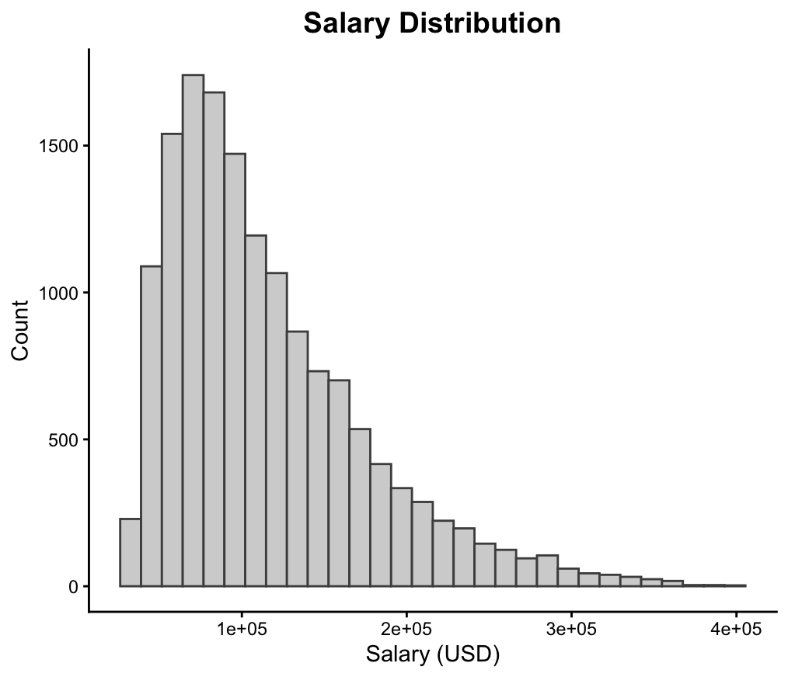

# AI Job Market Analysis (R)
Analysis of salary trends in the AI job market using R

## Overview
This project analyzes salary trends and key factors influencing compenstation in the AI job market.

## Dataset
The dataset used in this project is publicly available on Kaggle:
[Global AI Job Market & Salary Trends 2025] https://www.kaggle.com/datasets/bismasajjad/global-ai-job-market-and-salary-trends-2025

## Objectives
- Analyze salary distribution across roles and regions  
- Identify factors affecting compensation  
- Explore relationships between experience, job type, and salary

- ## Methods
- Data cleaning and preprocessing  
- Exploratory Data Analysis (EDA)  
- Data visualization  

- ## Tools
- R
- ggplot2 / dplyr

- ## Salary Trends by Experience and Region
<h3>Salary Trends by Experience and Region</h3>

  

Salaries increase significantly with experience, with North America leading across all levels.

Salaries increase significantly with experience, with North America leading across all levels.

- ## Salary Distribution
 
The distribution is right-skewed, indicating a concentration of mid-range salaries with high-end outliers.

- ## Key Insights
- Salary varies significantly by role and experience  
- Geographic location impacts salary distribution
  
## Author
Apostolia Fardi
